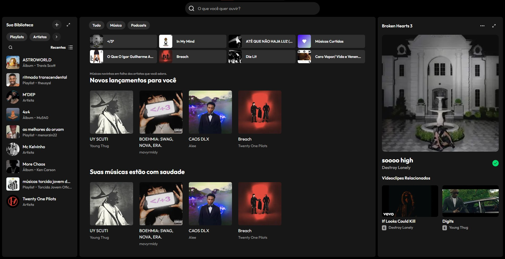

# 🎵 Spotify UI Clone

Clone da interface atual do Spotify feito para treinar **React**, **Next.js** e **TailwindCSS**.  
Projeto com foco em front-end, reproduzindo a experiência visual e interações da plataforma.



---

## 🚀 Tecnologias


---

## 📂 Estrutura do Projeto

```
├── components/ # Componentes reutilizáveis (PlayItem, RecentItem, etc.)
├── pages/ # Rotas do Next.js
├── public/ # Assets estáticos (imagens, ícones, etc.)
├── styles/ # Configurações extras do Tailwind
└── README.md
```

---

## 🛠 Como rodar o projeto

Clone o repositório:
```bash
git clone https://github.com/seu-usuario/spotify-clone.git
```

Instale as dependências:

```
npm install
# ou
yarn install
```

Rode em ambiente de desenvolvimento:

```
npm run dev
```

O app estará disponível em:

[http://localhost:3000](http://localhost:3000)

---

## 📌 Status

#### 🚧 Em desenvolvimento — novas funcionalidades serão adicionadas.

---

## 📜 Licença

Este projeto é apenas para fins de estudo, sem intenção comercial.

---